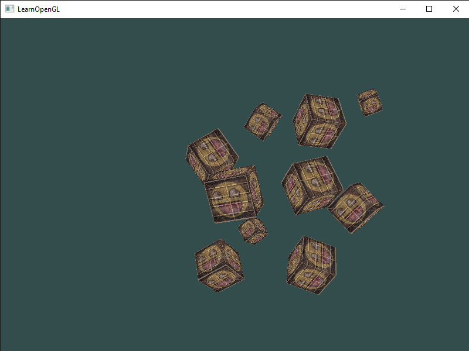
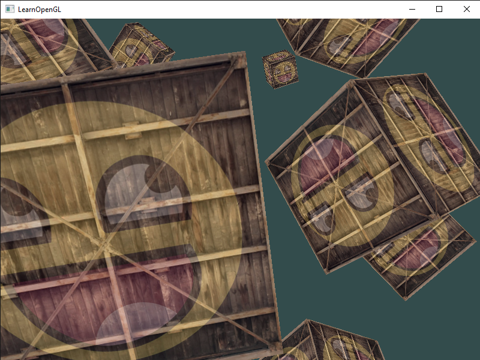
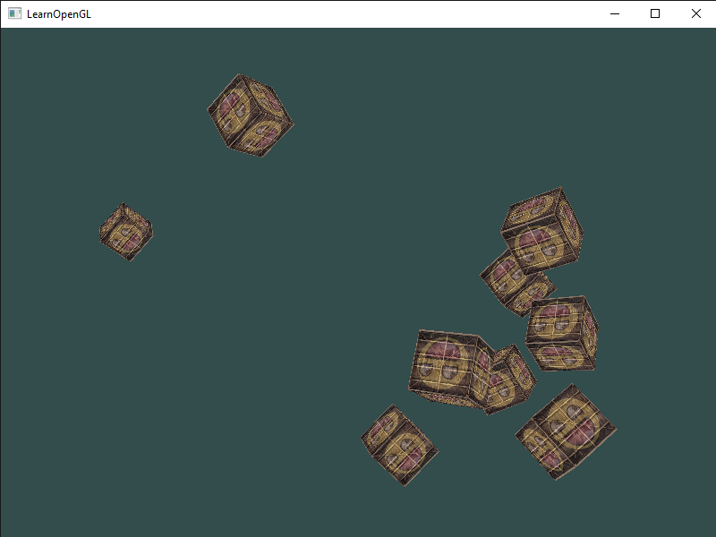
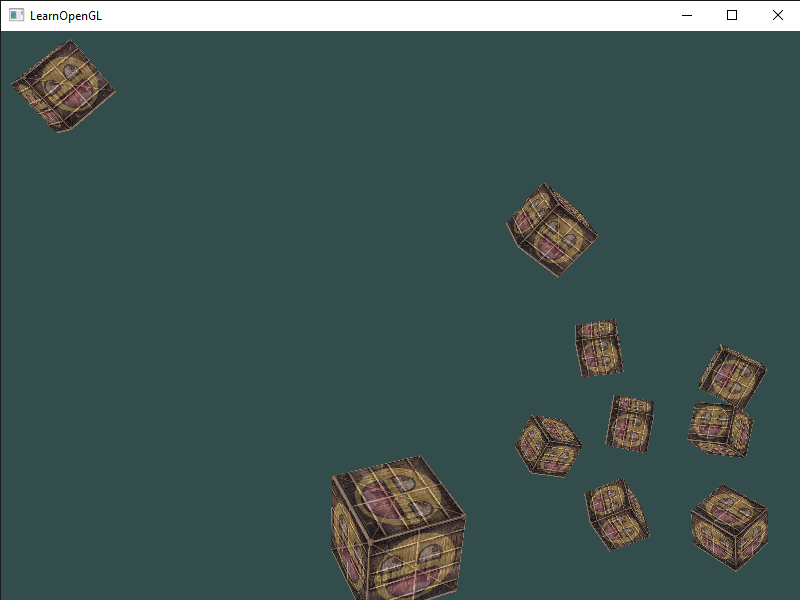

# Camera
Julia implementation of the C++ code from the [Camera](https://learnopengl.com/Getting-started/Camera) chapter.

Result from [camera_1.jl](camera_1.jl):

Result from [camera_2.jl](camera_2.jl):

Result from [camera_3.jl](camera_3.jl):

Result from [camera_4.jl](camera_4.jl):

