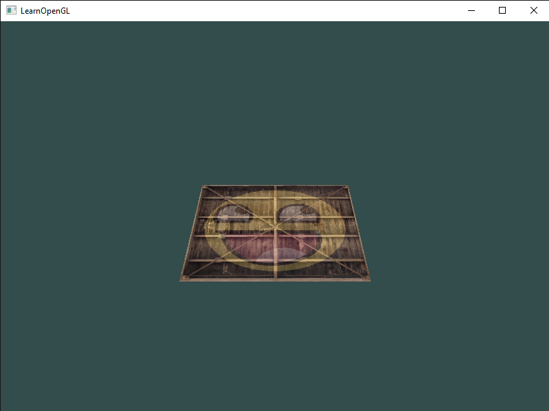
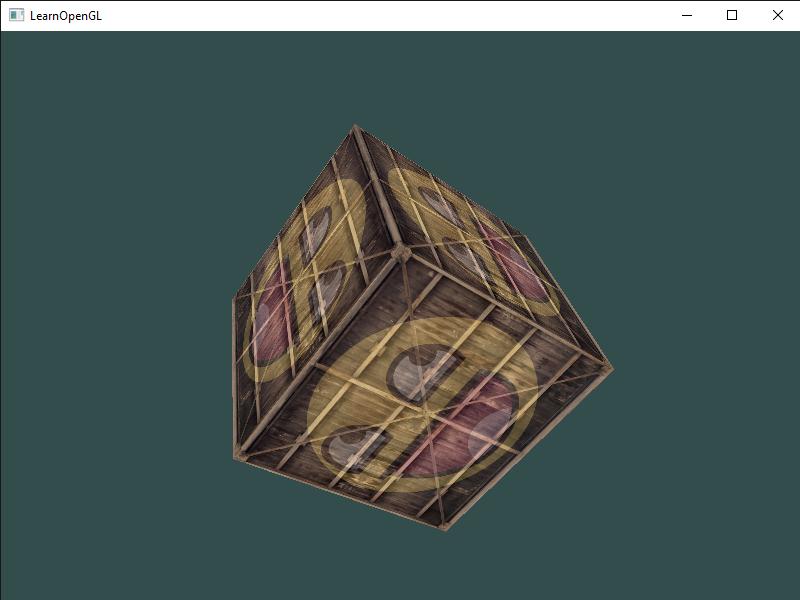
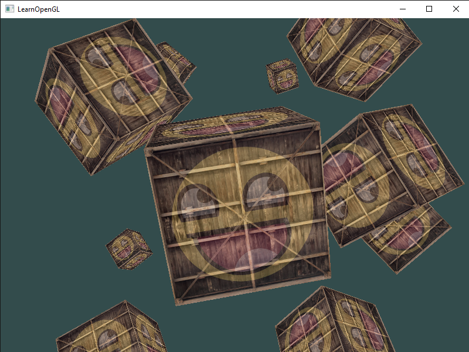

# Coordinate Systems
Julia implementation of the C++ code from the [Coordinate Systems](https://learnopengl.com/Getting-started/Coordinate-Systems) chapter.

Result from [coordinate_systems_1.jl](coordinate_systems_1.jl):

Result from [coordinate_systems_2.jl](coordinate_systems_2.jl):

Result from [coordinate_systems_3.jl](coordinate_systems_3.jl):

