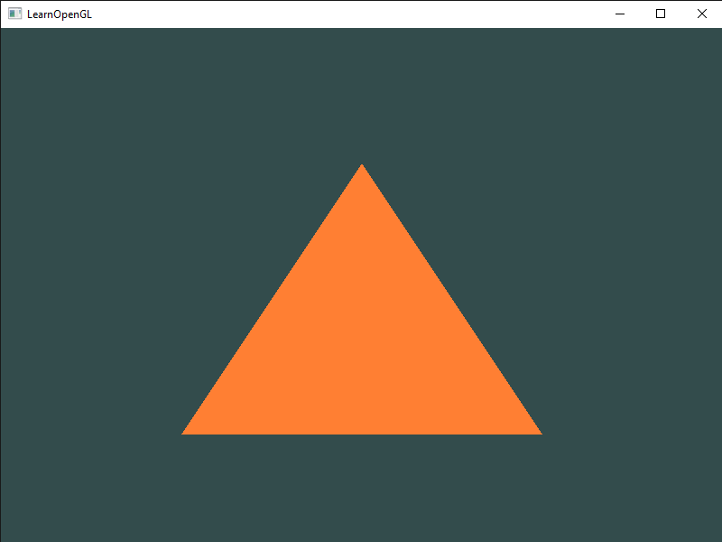
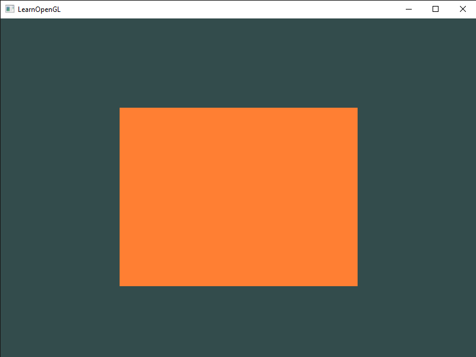

# Hello Triangle
 Julia implementation of the C++ code from the [Hello Triangle](https://learnopengl.com/Getting-started/Hello-Triangle) chapter.

 Result from [hello_triangle_1.jl](hello_triangle_1.jl):
 

 Result from [hello_triangle_2.jl](hello_triangle_2.jl):
 