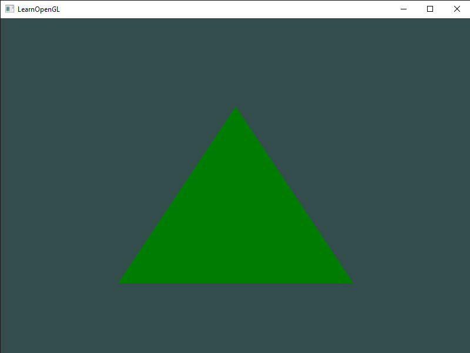
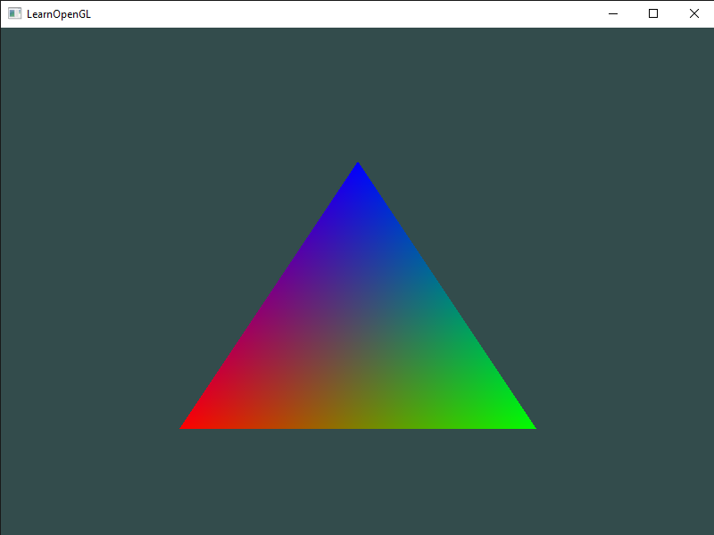

# Shaders
Julia implementation of the C++ code from the [Shaders](https://learnopengl.com/Getting-started/Shaders) chapter.

Result from [shaders_1.jl](shaders_1.jl):

Result from [shaders_2.jl](shaders_2.jl):

Result from [shaders_3.jl](shaders_3.jl):

