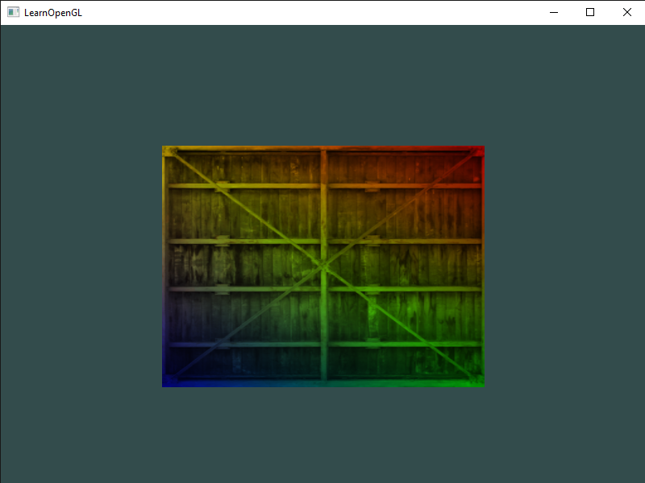
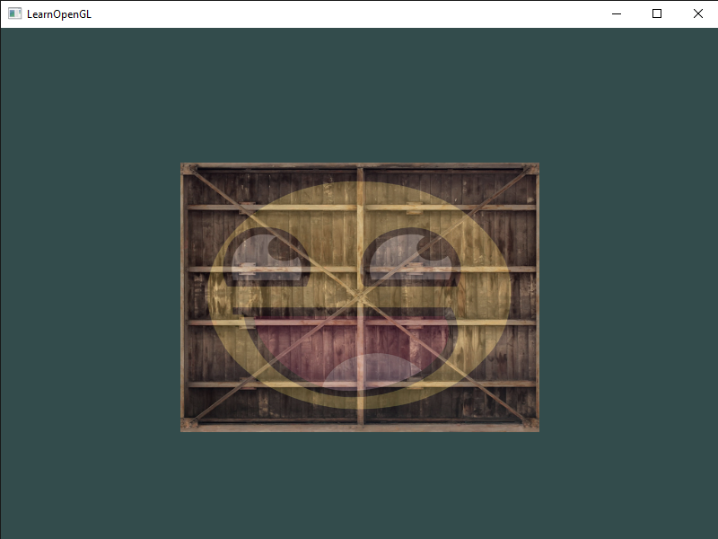

# Textures
 Julia implementation of the C++ code from the [Textures](https://learnopengl.com/Getting-started/Textures) chapter.

 Result from [textures_1.jl](textures_1.jl):
 

 Result from [textures_2.jl](textures_2.jl):
 